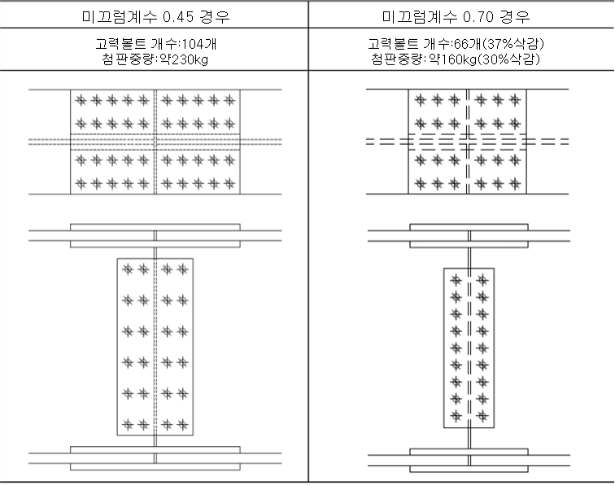
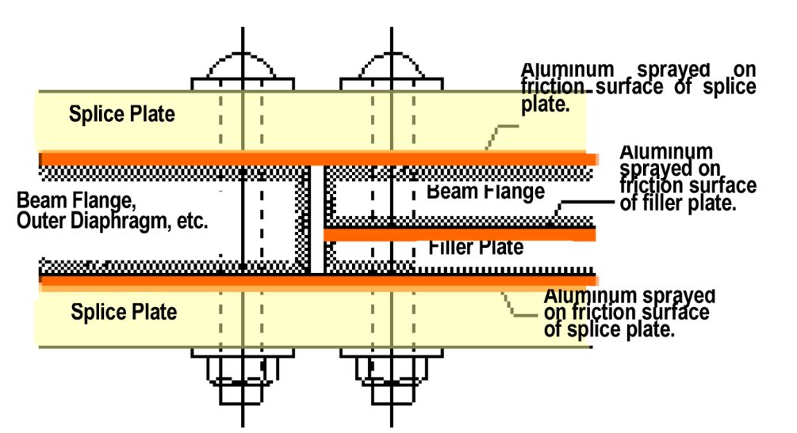

# 용어
고장력볼트
평균접촉압
# 서론

## 관련 연구
### 알루미늄용사첨판을 사용한 고장력볼트 마찰접합부의 미끄럼거동에 관한 연구 2016(アルミ溶射添板を用いた高力ボルト摩擦接合部のすべり挙動に関する研究_규슈대학 박사논문, AZUMA)

- 이 연구에서는 모재 마찰면을 블라스트 처리로 하고 이음판 마찰면에 알루미늄 용사를 한 고장력볼트 마찰접합부를 대상으로, 볼트강도, 볼트의 공칭직경, 이음판 두께 및 볼트배치와 같은 이음부의 상세가 평균마찰계수에 미치는 영향을 분석하여, 높은 미끄럼계수를 설계에 반영하기 위한 접합부 사양을 선정하였다. 
- 이를 위해 마찰면에 알루미늄 용사를 실시한 시험편을 제작하고 볼트방향으로 일정하중을 부여한 상태에서 미끌림방향으로 행해진 가력실험을 통해 마찰계수와 접촉압의 관계를 조사하였다. 또한 시험 후 미세단면 관찰 및 경도 시험을 통해 알루미늄 용사 피막의 손상정도를 조사하였으며, 관련 이론식의 적합성을 검증했다. 이 연구의 결과는 다음과 같다.
   1) 알루미늄용사 이음판을 사용한 고장력볼트 마찰접합부의 미끄럼계수는 평균지압응력이 작을수록 크다. 즉, 평균지압응력이 클수록 볼트강도가 낮을수록 볼트 직경이 작을수록, 그리고, 복수갯수로 밀집하게 배치된 경우에는 연단거리와 피치가 클 수록 평균접촉압이 작게 되고 미끄럼계수는 크게 된다. 
   2) 미끄럼계수는 알루미늄용사 피복두께에 영향을 받는데, 용사두께가 400μm까지는 두꺼워 질수록 마찰계수가 높아지며, 이것을 바탕으로 그림5.2는 막두께 300μm이상에서의 하한에 위치한다고 생각되어진다.
   3) 알루미늄용사 이음판 모재를 블라스트 처리한 마찰면의 마찰계수는 지압응력에 의존한다. 지압응력 37.5 MPa에서는 마찰계수가 0.9-1.08로 높고 접촉압 350 MPa에서는 0.33-0.53으로 낮다.
   4) 접촉압이 37.5-350 MPa 범위에서는 최종적인 파괴 형태는 모재 표층면이 알루미늄 용사 피복의 표층을 깎아내는 파괴 형태이다. 단, 깎아내는 영역과 알루미늄 용사 피막의 변형은 지압응력에 따라 크게 달라진다. 접촉압이 37.5 MPa로 작은 경우에는 깎아내는 영역은 부분적으로, 기공의 찌그러짐은 거의 없고 알루미늄 용사 피복 내부는 거의 변형되지 않는다. 접촉압이 150 MPa를 초과하여 커지면 깎아내는 영역은 마찰면 전체면이 되며, 알루미늄 용사 피막은 지압응력과 마찰력에 의해 기공이 찌그러지면서 크게 변형한다. 접촉압이 150-350 MPa의 범위에서는 알루미늄용사 피복의 전단파괴모드에 의해 마찰계수가 결정되는 것으로 추정된다.
   5) 알루미늄용사 피복의 전단 파괴 모드에 의해 마찰계수가 결정될 경우 알루미늄용사 피복부 변형에 따른 경도 상승을 고려함으로서, 실험 결과는 이론치와 유사한 값을 나타냈다.

그림 1 고미끄럼계수가 확보된 H형강 이음부 적용 시안(H-900X400X19X40)

- 마찰 계수는 접촉압이 150-350 MPa 범위에서는 기공률이 작은 밀실한 용사 피복보다 어느 정도 기공을 갖는 것이 높다. 용사법(용선식 프레임 용사, 고속 프레임 용사, 아크 용사, 플라즈마 용사)에서 보면 아크 용사가 가장 기공률이 높고 마찰 계수도 높다.
또한 이음판 두께 6-28mm에 대해 이음판 마찰면에 알루미늄 용사를 실시하고 모재 마찰면은 블라스트 처리로 한 1행 1열 배치의 고력 볼트 마찰 접합부를 대상으로 볼트 구멍 주변 마찰면에서의 접촉압 분포를 고려함으로써 평균 마찰계수 산정식을 도출했다. 또한 모재 두께 22 mm, 이음판 두께 6,16 mm, 호칭 직경 M24의 F14T급 고장력 볼트를 조합한 1열 배치의 볼트 접합부를 이용하여 이음판 두께와 볼트 장력을 변화시킴으로써 평균 접촉압을 산정한 파라미터로 한 미끄럼 시험을 실시하고, 산정식의 타당성을 검증했다. 결과는 다음과 같다.
- 마찰계수와 접촉압의 관계에 제2장에서 얻은 기초실험에 의한 근사식을 이용하여 볼트구멍 주변에서의 접촉압 분포형상을 볼트구멍 근방에서 최대치를 채취함에 따라 선형적으로 감소해 나가는 것으로 하여, 평균 마찰계수 산정식을 도출하였다. 산정식에 의한 평균 마찰계수 는 평균 접촉압σm이 작아지면 높아지는 현상을 나타내며, 일반적인 고력볼트와 이음판의 조합에 대해, σm은 27-200 MPa, 는 0.62-1.04 범위에 분포했다. 이러한 결과를 바탕으로 평균 마찰계수와 평균 접촉압의 관계를 근사식으로 하여 식 (3.10)을 제시했다.

$$\mu_j = 1.04\times 10^{-5}\sigma_m^2 - 4.73\times 10^{-3}\sigma_m + 1.15$$

미끄럼시험 결과를 평균 마찰계수 $\mu_j$와 평균 접촉압 $\sigma_m$의 관계로 정리하고 식(1)에 의한 평균 마찰계수의 산정치와 비교한 결과, $\sigma_m$이 16-140 MPa의 범위에서, 실험치는 산정치에 대해 0.93-1.23으로 대체로 ~~~좋은 대응을 보였다~~~. 미끄럼에 따른 축력 저하를 고려한 볼트 장력 N을 이용함으로써 식(1)에 의해 평균 마찰계수를 대략 평가할 수 있다.
계획 시의 평균접촉압 이 90 MPa 전후(미끄럼에 따른 축력저하를 고려한 볼트장력 N을 이용하여 산출한 평균접촉압 에서 50-80 MPa)에서는 알루미늄 용사피막이 볼트구멍 근방에서 막두께가 감소함에 따라 접촉압의 분포영역이 넓어지고, 그 결과 마찰계수는 약간 높아지는 것으로 언급되었다. 실험에서 확인된 용사피막 두께 감소량을 바탕으로 FEM 해석을 실시한 결과, 이때 접촉압의 확산은 고력볼트의 ~~~수하좌면~~~과 이음판이 접촉하는 부분에서 판두께 방향으로 45° 각도로 퍼지는 것으로 한 경우의 1.3배 정도가 되었다.

5.3 높은 미끄럼계수화를 위한 접합부사양선택의 고려방법
그림5.2에서 알루미늄 용사첨판을 사용한 고력볼트마찰접합부의 미끄럼계수는 평균접촉압이 작을수록 크게 된다. 즉, 첨판압이 클수록 볼트강도가 낮을수록 볼트경이 잘을수록, 그리고, 복수갯수로 밀집하게 배치된 경우에는 연단거리·피치가 클수록 평균접촉압이 작게 되고 미끄럼계수는 크게 된다. 미끄럼계수는 알루미늄 용사피막두께에도 영향을 받아. 400μm까지는 두꺼울질수록 높게 되는 것으로 보고되어져있고, 이것을 바탕으로 그림5.2는 막두께 300μm이상에서의 하한에 위치한다고 생각되어진다.

제4장에서는 1행 2열 배치의 2면 마찰접합부를 대상으로 볼트 배치(피치-연단거리 조합)와 이음판 두께를 파라미터로 한 미끄럼시험을 실시하여 평균 마찰계수에 미치는 영향을 검토하였다. 또한 실험결과를 평균 마찰계수와 평균 접촉압과의 관계로서 정리하고 식(3.10)에서의 산정값과 비교하였다. 얻어진 결과를 다음과 같이 정리한다.
평균 마찰계수 μf는 이음판 두께가 16-28mm에서는 판 두께가 클수록 볼트 배치가 표준 피치(p=80mm, e1=40mm)로 최소 피치(p=55mm, e1=30mm)에서는 배치가 적을수로 높아졌다. 평균 마찰계수의 시험수준별 평균값은 이음판두께가 28mm일 경우에는 최소피치에서 1.00, 표준피치에서 1.07이었다. 이음판두께가 작아질수록 평균 마찰계수는 저하되고 이음판두께 16mm에서 시험수준별 평균값은 최소피치에서 0.90, 표준피치에서 0.98이었다.
접촉압 분포 외연반경을 볼트 수하좌면의 외연반경에서 판두께 방향으로 45°로 넓혀지는 것으로 한 값의 1.3배로서 평균 접촉압을 산출하고, 평균 마찰계수와의 관계로서 실험결과를 정리한 결과, 양쪽에는 상관관계가 나타났다. 또한 식 (3.10)으로 제시한 평균 마찰계수와 평균 접촉압의 관계식과 비교한 결과, 실험결과는 식 (3.10)에 의한 산정치의 0.98-1.10배로 좋은 대응을 보였다. 피치·연단거리가 작고, 볼트간에 일부 접촉압 분포영역이 중첩되거나 단부에서 충분한 마찰면적이 확보되지 않는 경우에도 식(3.10)에 따라 평균마찰계수와 평균접촉압의 관계를 평가할 수 있다.     
제5장에서는 접합부 설계에서 필요한 미끄럼계수를 대상으로 미끄럼에 따른 볼트 장력의 저하를 실험결과로부터 근사함으로써 식(3.10)을 미끄럼계수와 평균접촉압의 관계로 전개하였다. 도출한 식에 의한 산정값과 4장에서 얻은 미끄럼시험 결과와의 대응을 비교한 결과, 실험결과는 산정값의 0.99~1.11배로 좋은 대응을 보였다. 알루미늄 용사이음판을 이용한 고력볼트 마찰접합부의 미끄럼계수는 평균 접촉압이 작을수록 커진다. 즉, 이음판 두께가 클수록 볼트 강도가 낮을수록 볼트 직경이 작을수록, 또, 복수 볼트개수로 조밀하게 배치된 경우에는 연단거리・피치가 클수록 평균 접촉압이 작아지고 미끄럼계수는 커진다. 이 점을 감안하여 접합부 사양을 선정함으로써 미끄럼계수 0.70~0.89로 종래 대비 1.6~2.0배로 높은 미끄럼계수화할 수 있다.
6.2 향후 과제
이미 기술한 바와 같이 이음판 마찰면에 알루미늄 용사를 한 고강도 볼트 마찰 접합부의 평균 마찰계수는 용사피막 두께에도 영향을 받아 400μm까지는 두꺼운막이 될수록 높아진다는 것이 보고되어있다 6.1). 본 논문에서 도출한 평균 마찰 계수 산정식은 이 인자가 고려되어 있지 않다. 이에 대해서는 향후 과제이다.
이 논문에서는 모재 마찰면 처리를 블라스트 처리에 의한 강재의 거친면으로 하고 있는데, 토목 교량 분야로 눈을 돌리면 무기징크리치 페인트 도장이 주류를 이루고 있다. 야마구치 외 6.2), 6.3), 6. 4)는 이음판(토목 분야에서는 첨접판이라고 호칭)의 마찰면에 알루미늄 용사를 실시하고, 모재 마찰면에는 무기징크리치 페인트도장한 경우의 미끄럼시험을 실시하고 있다. 그 결과 미끄럼 계수는 모재 마찰면이 블라스트 처리의 경우보다는 낮아지되 0.7~0.8 정도로 기존의 무기징크리치 페인트처리시의 설계 미끄럼계수 0.45보다도 큰 값이 된다는 것을 보고하고 있다. 모재 마찰면 처리가 무기징크리치 페인트 도장 등, 강재의 거친면과 다른 경우에 대해서도 높은 미끄럼계수화의 가능성이 있어 마찰면 파괴성 상태 조사를 포함하여 향후 과제로 생각한다.

### 고력육각볼트 미끄럼계수 시험_1988 (高力六角ボルトすべり係数試験, MORIMOTO 외 1)
이 연구에서는 접합면에 두꺼운 막형 징크리치페인트도포면과 숏트(적청)면이 혼재한 고력볼트 마찰접합이음은 사용상 문제가 없으믕ㄹ 확인하였다. 이 연구결과에 따르면 표준볼트 축력에서 산출한 미끄럼계수 $\mu$는 2면숏트(적청)이 가장 크고 0.65, 그리고 2면 징크가 0.61, 1면 징크+1면숏트(적청)이 0.59였다. 그러나, 시험직전의 볼트축력에서 산출한 미끄럼계수 $\mu$은 동일하게 0.67, 0.66, 0.63으로 2면징크와 2면숏트(적청)에서 거의 차가 없었다. 이상에서 1면징크+1면숏트(적청)의 미끄럼계수도 설계치0.4룰 충분히 만족하고 있다.

동변형계에 의한 측정의 결과, 1면징크+1면숏트(적청)의 시험체는 미끄럼이 가까워질수록 두 개의 접합면의 차이에 의해 각 스프라이스의 각각의 앞뒤에서 그 양은 매우 적지만 휨응력이 발생하기 쉬운 경향이 있는 것을 알 수 있었다.

1면징크+1면숏트(적청)의 시험체에서 미끄럼이 어느 면에서 발생하느냐는 0.2초이내에서 동시에 발생하고 실용적으로는 2면모두 동시에 발생하는 것이 좋다고 생각한다. 

표면처리상황의 차이에 의한 2장 스프라이즈간의 응력분담에 대해서는 특별히 명료한 차이는 확인되지 않았다. 
미끄럼후의 접합면 관찰에서 징크면간의 접합에서는 볼트체결에 의해 충분히 징크도료간 결합하고 있고 숏트(적청)면 간의 접합보다도 미끄럼후의 저항이 크고 점점 더 미끄러지는 것으로 생각되어진다.

한쪽면이 이상하게 잘 미끌릴 경우(예를들어, 그리스가 도포된 경우처럼), 반대측의 미끄럼계수가 크더라도 전체에서의 접합력은 미끌리기 쉬운 측에 지배된다.

### 고력볼트마찰접합 연결부의 미끄럼계수 향상에 관한 실험적연구_2004(高力ボルト摩擦接合継手のすべり係数向上に関する実験的研究_KOIKE 외2)
설계미끄럼계수 향상을 목적으로 하여 높은 미끄럼계수를 가진 무기징크리치페인트 계발을 실시했다. 또한, 미끄럼계수의 확인, 엇갈림특성파악등을 목적으로 한 시험에 의해 미끄럼강도특성파악을 실시하고 마지막으로 계발한 고마찰무기징크를 실제교각에 적용한 경우의 고력볼트연결부의 합리화검증을 실시했다. 얻어진 결과는 다음과 같다.
미끄럼계수를 향상시키기 위해서는 안료를 경질화하는 것이 가장 효과적이며, 평균 미끄럼계수0.7을 넘는 고마찰형무기징크를 개발했다.
고마찰형무기징크의 릴렉세이션은 종래의 무기징크리치페인트과 같은 것이다.
소형시험, 중형미끄럼내하력시험결과에서 0.7을 초과하는 미끄럼계수를 확인했다. 또한, 미끄럼발생후에 미끄럼내하력이 저하하는 현상이 보였다.
횡모델미끄럼내하력시험결과에서 도시설계법에 따라 산출한 미끄럼계수는 0.7을 초과하고 고미끄럼계수를 얻었지만, 총미끄럼모멘트법을 적용하여 산출한 미끄럼계수는 소형시험, 중형 미끄럼내하력시험결과를 20%정도 하회했다. 이것은 (3)의 미끄럼후의 미끄럼내하력저하가 영향하고 있다고 생각된다.
볼트연결부의 시산을 한 결과, 설계미끄럼계수를 0.4에서 0.7로 함으로써 볼트갯수, 도장면적, 첨부접판중량은 약 40% 감소한다.

### 접시형고력볼트를 사용한 마찰접합의 연결부특성에 관한 연구_2013(皿型高力ボルトを用いた摩擦接合の継手特性に関する研究_TABATA외 3)
본 연구에서는 접시형 고력 볼트를 이용한 마찰접합 조인트의 강교량 실용화를 위해 마찰접합 조인트로서의 거동을 해명하는 것을 목적으로 실제 교량을 상정한 강종, 미끄럼/항복 내력비, 접합면수를 파라미터로 한 미끄럼시험과 함께 접촉압 분포 확인시험, 릴랙세이션 시험을 실시하여 그 역학적 거동을 밝혔다. 다음에 얻어진 결론을 설명한다.
1. 1행 2열 모델 공시체에 의한 미끄럼 시험 결과 접촉면에 무기 징크리치 페인트(목표 막두께 75μm)를 도포한 모든 시험에서 상대변위가 0.2㎜에 달한 시점의 하중에 대해 시험전 축력을 이용하여 산출하였다.
미끄럼계수 μ1로 평가해도 설계에 요구되는 미끄럼계수 0.45를 초과했다.
2. 구멍처리한 강판에 항복점이 높은 강종 SM490을 이용하면 미끄럼계수 μ1은 상승했다. 이 이유는 기공 주변의 국부적 소성변형이 고강도화에 의해 개선되었기 때문으로 보인다. 개선 효과는 항복 선행형 조인트에서는 모재판 항복에 의한 판두께 감소가 선행되어 낮고, 모재판 항복의 영향이 없는 미끄럼 선행형 조인트에서는 높게 나타났다.
3. 미끄럼계수 μ1과 미끄럼/항복 내력비 βe의 관계에서 접합면 수, 볼트 종별에 관계없이 βe가 증가함에 따라 미끄럼계수는 저하되어 같은 βe일 경우 접합면 수에 관계없이 고력육각볼트에 비해 접시형고강도볼트는 동일하게 작아져, 2면조인트에서 최대 10%정도 낮아졌다.
그 이유는 접시형볼트의 구멍 주변의 국부적 소성변형에으로 인한 축력저하와 접합면 접촉압 불균등 등을 들 수 있다.
4. 고력육각볼트에 대해 접시형고력볼트의 미끄럼계수저하율은 2면조인트의 저하율에 비해 1면조인트의 그것이 낮아졌다. 이유는 연결판이 접시형으로 절삭됨으로써 그 판의 중립축이 낮아져, 1면조인트에서는 고력육각볼트보다 접시형고력볼트가 편심의 영향이 완화되었기 때문이라고 생각된다.
5. 접합면수에 따른 미끄럼계수μ1의 비교에서는 동일한 미끄럼/항복내력비의 경우, 볼트 종별에 관계없이 동일하게 1면조인트가 작아졌다. 이 이유는 1면조인트에 의한 편심휨의 영향을 받아 외측볼트보다 내측볼트의 축력저하가 탁월한 데다 연결판의 구멍처리 주변 국부적 변형에 따라 모재판 두께가 감소하고 양 볼트의 축력저하가 발생했기 때문이라고 생각된다.
6. 접촉압 분포 확인 시험 결과, 접시형고력볼트의 구멍 근방에는 높은 압력이 발생하고 있었다. 또한 구멍 주변의 분포성 상태는 고력육각볼트의 경우에 비해 균등화되지 않았고 한쪽으로 쏠린 것이 있는 것도 있었다. 또한 가압면적비에서는 접시형볼트가 육각볼트의 약 90% 정도였기 때문에 미끄럼계수 저하의 한 원인이라고 생각된다.
7. 릴랙세이션 시험 결과 30일 경과 시점에서 접시형고력볼트의 축력 감쇠율은 8~14%로, 고력육각볼트의 그것과 거의 같았다. 
    
그림. 미끄럼 시험모습과 공시체 치수, 상대변위측정위치
     
### 알루미늄용사마찰면의 역학특성에 관한 기초적 연구_2014(アルミ溶射摩擦面の力学特性に関する基礎的研究_ASUMI 외2)
마찰면에 알루미늄 용사를 실시한 시험편을 이용하여 수평방향으로 일정하중을 부여한 상태에서 연직방향으로 뽑아내는 기초실험을 통해 접촉압과 마찰계수의 관계를 조사하였다. 또한, 용사층의 단면 마이크로 관찰 및 경도시험에 의해 마찰력 결정인자를 조사하여 기존 마찰이론과의 대응을 검증하였다. 그리고, 용사법 차이로 인해 발생하는 용사피막 기공률과 마찰계수와의 관계를 설명하고 고찰하였다. 얻은 결과는 다음과 같다.
기초 실험을 통해 한쪽 면에 알루미늄 용사를 실시하고, 한쪽 면을 블러스트 처리한 마찰면의 마찰계수는 접촉압의 크기에 따라서도 달라지는 것을 밝혔다. 접촉압 37.5 MPa에서는 0.9-1.08로 높고 접촉압 350 MPa에서는 0.33-0.53으로 낮다. 또한 양면을 블라스트 처리한 마찰면에서는 접촉압 37.5-350 MPa 범위에서 0.5~0.65으로 거의 일정한 마찰계수를 나타냈다.
단면 마이크로 관찰에 의해 마찰면의 한쪽 면에 알루미늄용사를 실시하고 한쪽 면을 블라스트 처리했을 경우의 마찰 저항은 접촉압의 크기에 따라서도 다르다는 것을 밝혔다. 접촉압이 37.5 MPa로 낮을 경우에는 표층부분이 깎이는 응착·발굴 저항이 주체이지만 접촉압이 350 MPa로 높은 경우는 용사금속의 전단 저항이 주체가 된다.
(3) 단면 마이크로 관찰 및 용사 피막의 경도 시험에 의해, 알루미늄 용사 피막의 경도, 즉 전단저항은 용사피막의 기공률과 접촉압에 의존한다는 것을 밝혀냈다. 용사피막의 기공률이 클수록, 또 접촉압이 클수록 알루미늄 용사피막의 경도는 높아진다. 이는 용사피막의 소성변형에 따른 변형경화가 주된 요인이라고 생각된다.
(4) 기초 실험에서 얻은 마찰계수와 기존의 이론식에 의한 계산값을 비교한 결과, 좋은 대응을 보였다. 접촉압이 105N/mm2 이하인 실험값은 돌기형상이 원뿔형의 계산치 0.8과 파형의 계산치 1.2 사이에 대체로 분포했다. 접촉압이 높고 용사피막의 전단저항으로 마찰력이 결정되는 경우에는 계산값에 대해 0.86~1.52로 대응했다.
(5) 고미끄럼계수화의 관점에서는 기공률이 작은 밀실한 용사피막보다도 어느 정도 기공을 갖는 것이 적합하다고 할 수 있다. 용사법의 관점에서 보면 이번 결과는 아크 용사가 가장 기공률이 높았고 마찰 계수도 높은 결과를 나타내었다.
    
그림. 마찰계수와 기공율의 관계
     
### 고력볼트마찰접합의 미끄럼내력향상에 관한 실험적 연구_2016(高力ボルト摩擦接合のすべり耐力向上に関する実験的研究, SAWADA)
본 실험에서 얻은 미끄럼 내력 특성은 다음과 같다.
(1)볼트 축력의 릴렉세이션 특성
CS공법(저온저압형금속용사공법, 콜드스프레이공법) 시리즈는 현행 기준 무기징크와 대체로 비슷한 특성을 보여 막 두께나 표면 형상에 따른 차이가 없는 것으로 나타났다.
(2)미끄럼 특성
마찰면에 CS공법을 적용한 경우의 미끄럼계수는 마찰면에 무기징크를 적용한 경우와 동일하다.그러나 CS공법의 막두께가 두꺼운 경우 미끄럼계수가 상승했다. 반면 얇은 경우나 아연만을 이용했을 경우 미끄럼계수가 저하되는 경향을 얻었다.
     
그림. 각 파라메타에 대한 미끄럼계수     
     
### 이음판마찰면에 알루미늄용사를 한 고력볼트마찰접합부의 평균접촉압과 마찰계수에 관한 연구_2016(添板摩擦面にアルミ溶射を施した高力ボルト摩擦接合部の 平均接触圧と摩擦係数に関する研究, AZUMA 외1)
본 논문에서는 이음판 두께 6~28mm에 대하여 이음판마찰면에 알루미늄 용사를 실시하고 모재 마찰면은 블라스트처리로 한 고력볼트 2면마찰접합부를 대상으로 볼트접합부로서의 마찰계수 평가식을 도출했다. 또 모재 두께 22mm, 이음판 두께 6,16mm, 호칭 직경 M24의 F14T급 초고력 볼트를 조합한 1개 배치된 볼트접합부를 이용하여 이음판두께와 볼트장력을 변화시킴으로써 평균 접촉압을 파라미터로 한 미끄럼시험을 실시하여 평가식의 타당성을 검증하였다.
얻은 결과를 이하에 정리한다.
1. 마찰계수와 접촉압의 관계에 기초실험[2]에 의한 근사식을 이용하여 볼트 구멍 주변에서의 접촉압 분포 형상을 볼트 구멍 근방에서 최대값을 채취함에 따라 선형적으로 감소해 가는 것으로서 볼트 접합부로서의 마찰 계수 평가식을 도출하였다. 평가식에 의한 마찰계수 σj는 평균 접촉압 σm이 작아지면 높아지는 성상을 나타내어 일반적인 고력볼트와 이음판의 조합에 대해, σm은 27~200N/mm2, σ j는 0.62~1.04 범위에 분포하였다. 이들은 볼트장력 N을 설계볼트 장력으로 산출한 것으로, 실제로는 미끄럼에 따른 축력 저하가 발생하기 때문에 마찰계수가 약간 더 높을 것으로 생각된다.
2. 미끄럼 시험 결과를 마찰 계수 μf와 평균 접촉압 실적치 actσm의 관계로서 정리하고 평가식에 의한 계산치 μj와 비교한 결과, actσm이 16~140N/mm2의 범위에서 실험치는 계산치에 대해서 0.93~1.23으로 대체로 좋은 대응을 보였다. 미끄럼에 따른 축력 저하를 고려한 볼트 장력 N을 이용함으로써 식 (11)에 의해 볼트 접합부로서의 마찰계수를 대략 평가할 수 있다. 또한, 이번 미끄럼 시험에서는 시험 전 축력에 비해 13~26퍼센트의 축력 저하가 나타났다.
3. 평균 접촉압 $\sigma_m$ 이 90 MPa 전후 ( actσm 로 50~ 80N/mm2)에서는 알루미늄 용사 피막이 볼트 구멍 근방에서 막두께 감소는 접촉압의 분포 범위를 넓히고, 그 결과 마찰계수를 약간 증가시킬 것으로 생각된다. 실험에서 확인된 용사 피막 두께 감소량을 바탕으로 FEM 해석을 실시한 결과, 그 때의 접촉압의 확대는 고강도 볼트의 목하좌면과 이음판이 접촉하는 부분에서 판두께 방향으로 45° 각도로 넓어지는 것으로 했을 경우의 1.3배 정도가 되었다. 1개 배치로 마찰면적이 충분히 확보되었을 경우에는 마찰계수의 향상을 기대할 수 있지만, 복수 갯수로 구성되는 볼트 접합부를 생각할 경우에는 인접하는 볼트 간격이 작아지면 접촉압 분포 영역이 중첩되어 반대로 마찰계수가 저하될 수도 있으므로 볼트 배치에 배려할 필요가 있을 것으로 생각된다.
     
### 이음판마찰면에 알루미늄용사를 한 고력볼트마찰접합부의 볼트배치와 마찰계수에 관한 연구_2017(添板摩擦面にアルミ溶射を施した高力ボルト摩擦接合部の ボルト配置と摩擦係数に関する研究, AZUMA 외1)
이음판 마찰면에 알루미늄 용사를 한 고력 볼트 마찰 접합부는 복수 볼트의 경우 볼트 배치가 조밀해지면 미끄럼계수나 마찰계수가 저하되는 것으로 생각된다. 본 논문에서는 응력 방향으로 고력 볼트를 2개 배치한 2열 1행 배치의 2면 마찰 접합부를 대상으로 볼트배치와 이음판두께를 파라미터로 한 미끄럼시험을 실시하여 미끄럼계수에 미치는 영향을 검토하고, 평균 접촉압과 마찰계수와의 관계에 대해 검토하였다. 얻은 결과는 다음과 같다.
(1) 미끄럼계수μs는 이음판두께가 16~28mm에서는 판두께가 클수록 볼트배치가 표준피치(p=80mm, e1=40mm)와 최소피치(p=55mm, e1=30mm)에서는 배치가 조밀하지 않을수록 높아졌다. 미끄럼계수의 평균값은 이음판두께가 28mm인 경우에는 최소피치로 0.87, 표준피치에서 0.95였다. 이음판두께가 작아지면 미끄럼계수가 감소했고, 이음판두께 16mm에서 평균값은 최소 피치에서 0.70, 표준 피치에서 0.79였다.
(2) 접촉압 분포직경을 볼트 목하좌면의 외연에서 판두께 방향으로 45°로 넓히는 것으로 한 값의 1.3배로 하여 평균 접촉압을 산출하고 마찰계수와의 관계로서 실험결과를 정리한 결과, 양자간에는 상관관계가 나타났다. 또한 문헌[3]에 제시된 마찰계수 평가식을 이용하여 구한 근사식과의 대응을 본 결과, 실험결과는 근사식에 의한 평가치의 0.98~1.10배로 좋은 대응을 보였다. 피치·연단거리가 작고 볼트간에 일부 접촉압 분포영역이 중첩되거나 단부에서 충분한 마찰면적이 확보되지 않는 경우에도 평균 접촉압에 의해 평가계수를 평가할 수 있다고 생각한다.
평균 접촉압이 작아지면 마찰계수는 높아지므로 미끄럼계수도 높아질 것으로 생각된다. 따라서 이번 실험에서 얻은 미끄럼계수는 고력볼트가 F14T급 이하, 축직경 22mm 이하의 조건에서의 대략 하한에 위치한다고 생각해도 좋다. 또한 미끄럼 계수는 알루미늄 용사 피막 두께에도 영향을 받아 400㎛까지는 두꺼운 막이 될수록 높아진다고 보고되어 있으며[1], 이것을 감안하면 막 두께 300㎛ 이상의 하한에 위치한다고 생각된다.
설계에서 이용하는 미끄럼 계수를 만일 0.7로 하기 위해서는 편차도 고려하면 평균값으로 0.8 정도를 확보해 둘 필요가 있다고 생각한다. 이를 위한 수단으로서 본 논문의 결과에서는 이음판 두께나 피치·연단거리를 크게 설정하는 것을 들 수 있는데, 그 외에도 사용하는 고력볼트의 강도·축직경을 작은 범위로 한정하거나 알루미늄 용사 피막을 두껍게 하는 수단도 들 수 있다.
    
그림. 볼트접합부의 마찰계수-평균접촉압 관계
그림. 2개배치볼트접합부의 마찰계수-평균접촉압 관계
     
     
     
### 굵은 직경의 고력볼트를 이용한 마찰접합이음의 접촉압을 고려한 미끄럼계수에 관한 해석적 검토_2022(太径の高力ボルトを用いた摩擦接合継手の接続圧を考慮したすべり係数に関する解析的検討, UCHIDA 외3)
본 연구에서는 철도표준에서 규정하는 판두께 범위에서 접촉면을 무기징크로 한 고력볼트 마찰접합 이음에 굵은 직경 볼트를 이용한 경우에 주목하여 직경 M22, M30, M36의 볼트에 대해 체결두께를 변화시킨 모델과 볼트를 좁은 배치로 한 모델을 해석하여 미끄럼계수의 변화를 확인했다. 미끄럼계수를 정리할 수 있는 파라미터에 대해 모판과 첨접판간의 접촉압에 관한 검토를 실시하였다. 얻은 결과는 다음과 같다.
(1) 동일한 체결 두께로 비교하면 볼트 직경이 커질수록 미끄럼계수가 작아진다. 어느 볼트직경에서도 체결 두께가 커질수록 미끄럼계수가 증가한다.
(2) 표준 배치와 좁은 배치 모델을 비교하면 어느 볼트 직경이든 체결 두께가 작을 경우 배치에 따른 미끄럼계수의 차이는 인정할 수 없지만, 체결 두께가 클 경우에는 좁은 배치를 하면 미끄럼계수가 저하된다.
(3) 볼트직경에 상관없이 미끄럼계수를 볼트구멍 근처의 최대 접촉압으로 정리할 수 있는 가능성이 있다.
최대 접촉압으로 미끄럼계수를 정리함으로써 좁은 배치의 경우에 인접 볼트의 영향으로 미끄럼계수가 저하하는 경향도 평가할 수 있다.
(4) 강판을 하나의 볼트로 조인 기본 모델에서 폭방향 중앙 단면에서의 최대 접촉압을 구함으로써 이음매 모델의 최대 접촉압을 산정할 수 있는 가능성을 보여주었다. 보다 정밀하게 최대 접촉압을 평가하기 위해서는 3차원적 접촉압 분포의 확대를 고려한 중첩이 필요하다고 생각된다.
    
그림. 미끄럼계수와 첨접판압의 관계

## 적용 사례     
### 적용사례 1:
1의 논문에서 언급한 건축분야에서의 구체적 적용사례를 소개한다. 쿠마이 등이 여러조건에서의 미끄럼시험을 실시하여 설계용 미끄럼계수 0.7 또는 0.6을 채용가능한 조건을 제시하고, 일본건축종합시험소의 건축기술성능증명(BRC성능증명 제 11-24호 개정, 2015.03.19)을 취득한 제품이다. 강구조물의 고력볼트 2면마찰접합부에 첨부판측의 접촉면에 알루미늄용사를 실시함으로써 기존보다 높은 미끄럼계수를 얻을 수 있어, 고력볼트연결부의 콤팩트화를 의도하여 개발되었다.(일본의 요시카와공업(주) 개발, High “μ” Plate®)              
이 제품의 성능증명실험결과, 미끄럼계수 μ=0.7을 실현. (실험치는 μ≥0.8 이상)
따라서, 강구조접합부지침에 있는 설계용 미끄럼계수 μ=0.45에 대해, High “μ” Plate를 사용한 경우는 미끄럼계수 μ=0.7을 적용 가능하다. 단, 이음판두께ts 12mm≤ts<16mm는 μ=0.6 이 된다. 
이 제품의 실적그래프를 다음에 표시한다. 매년 증가하는 것을 알 수 있다.
    
그림. 알루미늄 용사이음판 제작중량
     
### ABENO HARUKAS (Hirakawa et al., 2014)
지상 60층, 높이 300m의 상업시설 빌딩으로 새로운 접합부를 적용하였다. 미끄럼계수는 0.7을 적용하였다.
    

그림. 건물 전경 용사두께:300μm이상 스프라이스플레이트:12mm이상 표면처리:블라스트
(위:알루미늄 용사접합부, 아래:미끄럼계수)

## 관련 특허
### 고력볼트 마찰접합용 스프라이트플레이트(高力ボルト 摩擦接合用スプライスプレ ート)_2012
강구조 접합부의 마찰저항력을 높이기 위해 필요한 스플라이스 플레이트의 마찰접합면에 실시하는 용사층의 구성요건을 명확히 하고, 고력볼트 마찰접합의 접합강도 및 수명을 높은 레벨에서 안정시킬 수 있도록 하기 위해, 마찰접합면에 금속용사에 의한 용사층 2를 형성한 고력볼트 마찰접합용 스플라이스 플레이트 1에 있어서, 용사층 2의 표면으로부터 용사층 2의 내부를 향해 150±25μm의 위치 까지의 부분(표면측 용사층 2a)의 기공률을 10%이상 30%이하로 하고, 또한 용사층 2의 표면 으로부터 용사층 내부를 향해 150±25μm의 위치로부터 스플라이스 플레이트 모재 3과 용사층 2와의 계면까지의 부분(계면측 용사층 2b)의 기공률을 5%이상 10%미만으로 했다.
특허의 청구 범위는 다음과 같다: 
[청구항 1] 마찰접합면에 금속용사에 의한 용사층을 형성한 고력볼트 마찰접합용 스플라이스 플레이트에 대해서 용사층 중 표면측에 위치하는 표면측 용사층의 기공률이 상기 표면측 용사층보다 스플 라이스 플레이트 모재와의 계면측에 위치하는 계면측 용사층의 기공률이 큰 것을 특징으로 하는 고력 볼트 마찰접합용 스플라이스 플레이트.
[청구항 2] 상기 표면측 용사층의 기공률은 10% 이상 30% 이하이고, 상기 계면측 용사층의 기공률이 5% 이상 10% 미만인 청구항 1에 기재된 고력볼트 마찰접합용 스플라이스 플레이트.
【청구항 3】 상기 표면측 용사층의 두께가 150±25㎛인 청구항 1항 또는 제2항에 기재된 고력볼트 마찰접 합용 스플라이스 플레이트.
【청구항 4】 상기 표면측 용사층의 표면 거칠기의 십점 평균 거칠기 Rz가 150㎛ 이상 300㎛ 이하인 청구항 1~3 중 어느 한 항에 고력볼트 마찰 접합용 스플라이스 플레이트.
     
표. 용사층의 기공률 및 미끄럼계수 측정결과
    
### 고력볼트 마찰접합구조(高力ボルト 摩擦接合構造)_2015
【청구항 1】 접촉압이 낮을수록 마찰계수가 높아지도록 마찰면 처리를 한 고력볼트 마찰접합구조에 대해 접합해야 할 양 접합재의 접합면 중 적어도 한쪽 접합면에 상기 마찰면 처리가 이루어져, 상기 양 접합재 중 적어도 한쪽 접합재의 상기 접합면과 반대쪽 표면에 판형 접촉압 저감부재가 마련되며, 상기 양접합재와 상기 접촉압저감부재에 각각 형성된 볼트 구멍에 상기 고력볼트가 그 볼트머리의 와셔면에 와셔를 설치하지 않은 상태에서 또한 상기 접촉압저감부재의 측으로부터 관통됨과 동시에 해당 고력볼트에 너트가 나사선으로 조여지며, 상기 고력볼트의 상기 볼트머리의 와셔면과 접촉하고 있는 상기 접촉압저감부재는, 해당 접촉압저감부재의 상기 볼트머리의 와셔면과 접촉하고 있는 표면에서 상기 접합재의 두께를 포함하여, 상기 접합면까지의 거리가 상기 고력볼트의 볼트지름의 절반 이상이 되는 두께를 가짐과 동시에, 상기 볼트구멍의 중심에서 상기 접촉압저감부재 외주단까지의 최단거리가 볼트지름 이상이 되게하는 크기를 가지는 것을 특징으로 하는 고강도볼트 마찰접합구조.
     
# 참고문헌
고력육각볼트 미끄럼계수 시험_1988 (高力六角ボルトすべり係数試験, MORIMOTO 외 1)
알루미늄용사첨판을 사용한 고력볼트마찰접합부의 미끄럼거동에 관한 연구 2016(アルミ溶射添板を用いた高力ボルト摩擦接合部のすべり挙動に関する研究_규슈대학 박사논문, AZUMA)
고력볼트마찰접합 연결부의 미끄럼계수 향상에 관한 실험적연구_2004(高力ボルト摩擦接合継手のすべり係数向上に関する実験的研究_KOIKE 외2)
접시형고력볼트를 사용한 마찰접합의 연결부특성에 관한 연구_2013(皿型高力ボルトを用いた摩擦接合の継手特性に関する研究_TABATA외 3)
알루미늄용사마찰면의 역학특성에 관한 기초적 연구_2014(アルミ溶射摩擦面の力学特性に関する基礎的研究_ASUMI 외2)
고력볼트마찰접합의 미끄럼내력향상에 관한 실험적 연구_2016(高力ボルト摩擦接合のすべり耐力向上に関する実験的研究, SAWADA)
이음판마찰면에 알루미늄용사를 한 고력볼트마찰접합부의 평균접촉압과 마찰계수에 관한 연구_2016(添板摩擦面にアルミ溶射を施した高力ボルト摩擦接合部の 平均接触圧と摩擦係数に関する研究, AZUMA 외1)
이음판마찰면에 알루미늄용사를 한 고력볼트마찰접합부의 볼트배치와 마찰계수에 관한 연구_2017(添板摩擦面にアルミ溶射を施した高力ボルト摩擦接合部の ボルト配置と摩擦係数に関する研究, AZUMA 외1)
굵은 직경의 고력볼트를 이용한 마찰접합이음의 접촉압을 고려한 미끄럼계수에 관한 해석적 검토_2022(太径の高力ボルトを用いた摩擦接合継手の接続圧を考慮したすべり係数に関する解析的検討, UCHIDA 외3)

고력볼트 마찰접합용 스프라이트플레이트(高力ボルト 摩擦接合用スプライスプレ ート)_2012
고력볼트 마찰접합구조(高力ボルト 摩擦接合構造)_2015

Hirakawa, K., Saburi, K., Kushima, S., Kojima, K., 2014. Performance-based Design of 300 m Vertical City ``ABENO HARUKAS’’. International Journal of High-Rise Buildings 3, 35–48.
