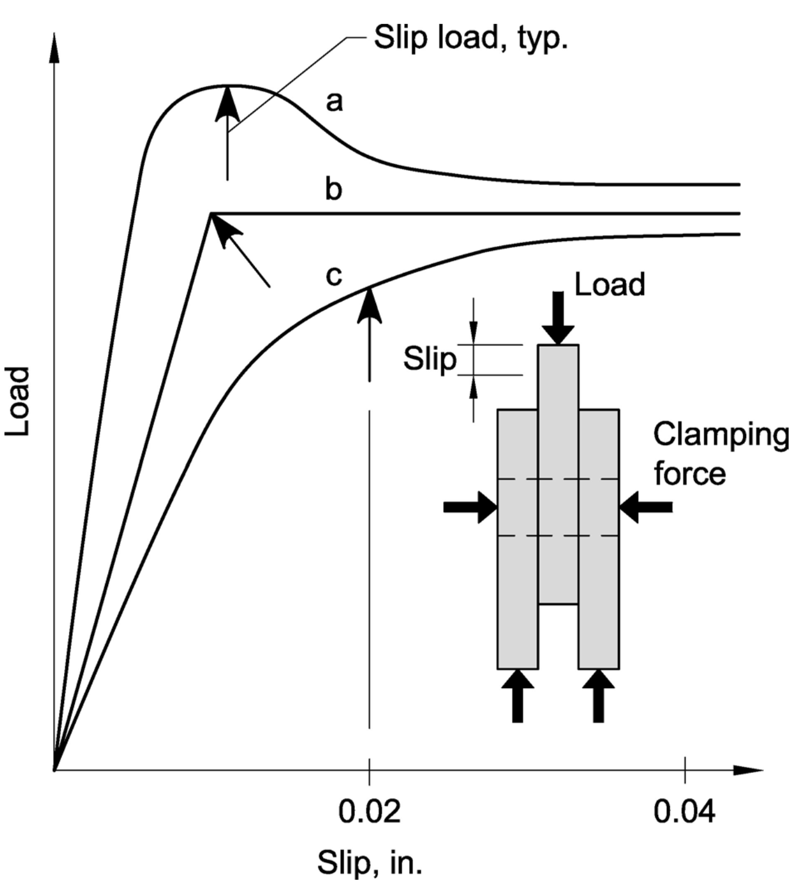
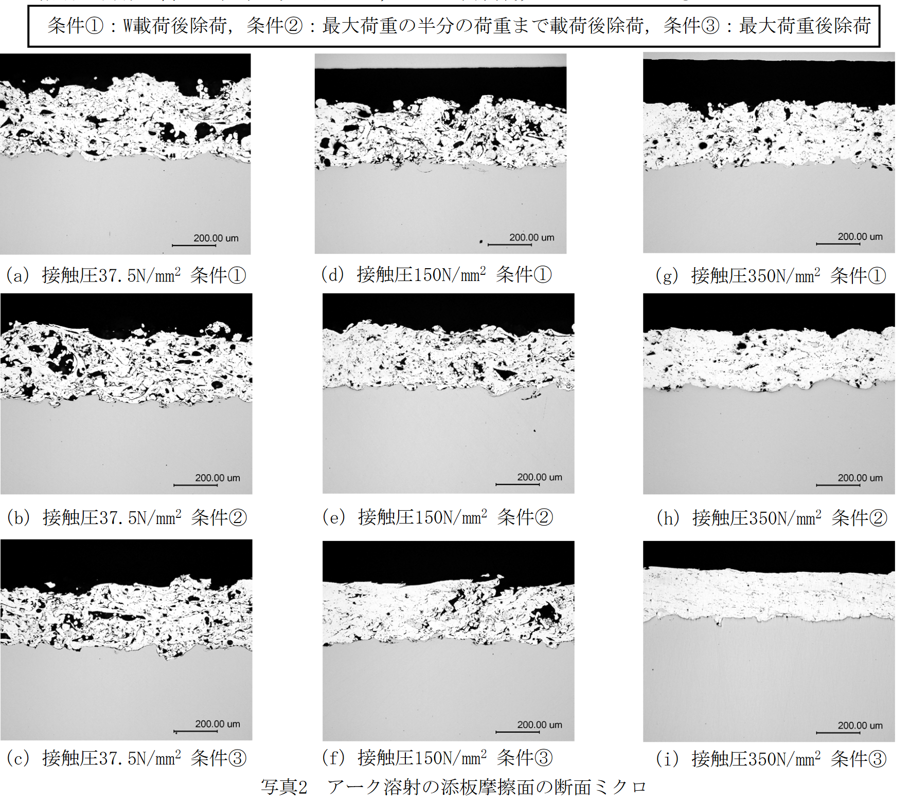
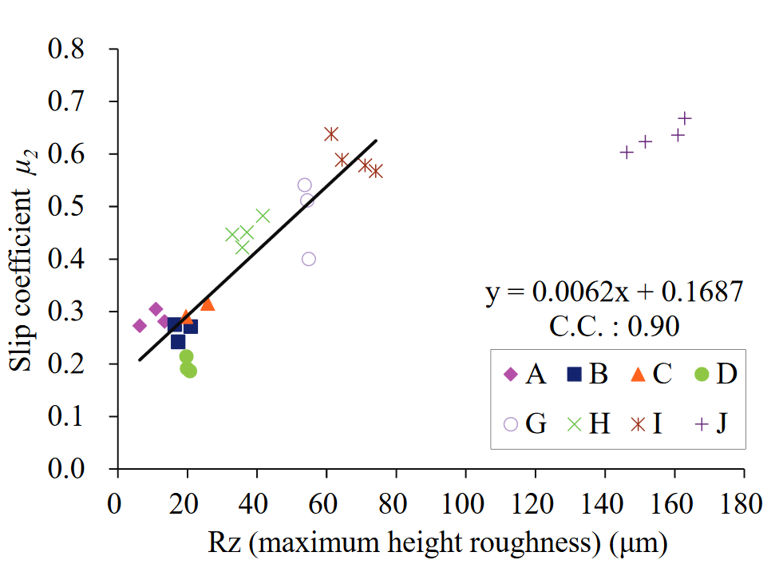
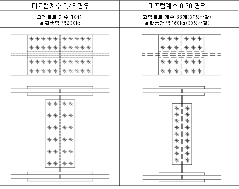

## 서론
접합부 설계는 강구조물의 안전과 신뢰성을 위한 핵심적 과제이며, 마찰 접합은 고장력 볼트의 강력한 조임력에 의해 부재 간에 발생하는 마찰력을 통해 응력을 전달하는 접합 형식입니다. 아래 그림과 같이 2장의 판을 고장력 볼트로 강하게 조이면 판의 접촉면에 큰 마찰 저항이 생기므로 고장력 볼트 축과 볼트 구멍의 내벽이 밀착되지 않더라도 전단 접합과 같은 힘을 전달할 수 있습니다. 이 부위에서의 미끄러짐은 구조물의 수명 동안 최소화되어야 합니다. 그러나 미끄러짐을 방지하려면 높은 비용이 들 수 있으며, 이로 인해 구조물의 사용 가능성이나 최대 강도에 영향을 미칠 수 있습니다. 따라서 각 나라의 설계 지침은 이러한 문제를 해결하고 미끄러짐을 방지하기 위해 중요한 역할을 합니다.

따라서, 마찰 접합은 응력의 흐름이 원활하며 접합부의 강성이 높으며, 부재의 접합면에서 응력이 전달되기 때문에 국부적인 응력 집중 현상이 생길 염려가 없습니다. 특히 중요한 연결부위에서의 미끄러짐은 큰 주의가 필요합니다.

응력이 부재 간의 마찰력을 초과하게 되면 미끄러짐 현상이 발생하게 되는데, 이 때의 마찰 계수를 미끄럼 계수라고 합니다.

더구나, 접합부의 미끄러짐이 구조에 부정적인 2차 효과를 초래하여 구조물의 안정성과 강도를 감소시킬 수 있음을 감안하여 AISC 사양은 2005년 버전에 요인 부하 수준에서 미끄러짐 방지 설계 조항을 도입하였습니다. 이로써 미끄러짐이 중요한 조인트의 설계는 전통적으로 서비스 부하 수준에서 미끄러짐을 방지하기 위해 수행되었으며, 이로 인해 서비스 로드 수준에서 미끄러짐의 결과가 최소화되었습니다.

특히 KDS와 같은 설계 기준은 미끄럼 임계 조인트가 사용 중 조건에서 미끄러짐을 방지하고 계수하중에서 파열을 방지하도록 설계하는 것을 권장합니다. 이것은 미끄럼 임계 조인트가 인수 하중 수준에서 베어링 유형 조인트처럼 작동하도록 하는 중요한 요소입니다.

뿐만 아니라, 최근에는 미끄럼 계수를 개선하고 비용을 절감하기 위해 볼트 수량과 이음판의 크기를 줄이는 접합 방법이 도입되었습니다. 이 연구에서는 KDS 14, AISC Specification 2022, 그리고 2020 Bolt Council Specifications (RCSC, 2020)을 검토하며, 모재 마찰면과 이음판 마찰면 처리, 볼트 강도, 볼트의 공칭 직경, 이음판 두께, 그리고 볼트 배치와 같은 다양한 요인이 평균 마찰 계수에 미치는 영향을 분석하였습니다. 이러한 연구를 통해 높은 미끄럼 계수를 설계에 반영하기 위한 접합부 사양을 개선하고자 하는 노력이 진행되고 있음을 소개합니다.

이와 같은 연구와 관련된 기준은 구조물의 안전성을 확보하고 미끄러짐 문제에 대한 효과적인 대응을 위해 중요한 역할을 합니다. 이어지는 내용에서는 이러한 연구와 관련된 기준을 더 자세히 살펴보겠습니다.

## 관련 기준

### 국내: KDS 14 31 25:2017
국내기준의 경우 마찰접합은 미끄럼을 방지하고 지압접합에 의한 한계상태에 대하여도 검토해야 한다. 마찰볼트에 끼움재를 사용할 경우에는 미끄럼에 관련되는 모든 접촉면에서 미끄럼에 저항할 수 있도록 해야 한다. 미끄럼 한계상태에 대한 마찰접합의 설계강도는 하중계수 $\phi$를 표준구멍 또는 하중방향에 수직인 단슬롯에 대하여 1.00을, 과대구멍 또는 하중방향에 평행한 단슬롯에 대하여 0.85를, 장슬롯에 대하여 0.70을 적용하여 다음과 같이 산정한다. 

$$R_n = \mu h_{f} T_o N_s$$

여기서, $\mu$는 미끄럼계수로 무도장 블라스트 처리한 마찰면에 대해 0.5를, 무기질 아연말 프라이머 도장한 표면에 대해 0.45를 적용하고; $h_f$는 끼움재계수로, 끼움재를 사용하지 않는 경우와 끼움재 내 하중의 분산을 위하여 볼트를 추가한 경우 또는 끼움재에 대해 1.0을, 끼움재 내 하중의 분산을 위해 볼트를 추가하지 않은 경우로서 접합되는 재료 사이에 2개 이상의 끼움재가 있는 경우 0.85를 적용하고 $T_o$는 고장력볼트의 설계볼트장력 (kN)이며; $N_s$는 전단면의 수이다. 

### 미국: AISC Specification (2016)과 RSCS (2020)

#### 마찰설계강도 기준
AISC Specification 2016의 경우 사용하중과 계수하중에서 미끄러짐을 방지하기 위한 이음부 또는 접합부 설계에 있어, 마찰접합이 제공하는 안전수준을 평가하기 위해서는 평균값, 미끄럼계수와 볼트 조임력의 변화가 신뢰성 분석에 포함되어야 한다. 미끄럼 한계상태에 대한 마찰접합의 설계강도는 하중계수 $\phi$를 표준구멍 또는 하중방향에 수직인 단슬롯에 대하여 1.00을, 과대구멍 또는 하중방향에 평행한 단슬롯에 대하여 0.85를, 장슬롯에 대하여 0.70을 적용하여 다음과 같이 산정한다. 

$$R_n = \mu D_u h_{f} T_b n_s$$

여기서 $T$는 고장력볼트의 설계볼트장력, $n_s$와 $h_f$ 각각 마찰면의 수와 끼움재계수로 KDS와 동일하게 정의되고, $D_u$는 건축 구조물의 경우 1.13, 교량의 경우 1.00이다. $\mu$는 Class A 또는 B 등급에 대한 평균 미끄럼계수로, 다음을 따르거나 혹인 실험에 의해 규명된 값을 따른다: Class A표면으로, 세척된 강철 또는 용융 아연 도금 0.30 클래스 B 표면의 경우(도색되지 않은 블라스트 세척된 강철 표면 또는 블라스트 세척된 강철에 클래스 B 코팅이 있는 표면) 0.50이다.  

AISC Spec on Slip Coefficient for Class A Surfaces. 
Grondin et al. (2007) rigorously evaluated the test procedures and eliminated a substantial number of tests that did not meet the required protocol. The result was a recommended slip coefficient for Class A surfaces between 0.31 and 0.32. Part of the problem is the variability of what is considered to be clean mill scale. Current data on galvanized surfaces indicated more research was required and the American Galvanizers Association is sponsoring a series of tests to determine if further changes in the slip coefficient for these types of surfaces is needed.

RCSC의 경우 
Section 3.2.2(2) permits the Engineer of Record to authorize the use of faying surfaces with a mean slip coefficient, $\mu$, that is less than 0.50 (Class B) and other than 0.30 (Class A). This authorization requires that the mean slip coefficient, $\mu$, be determined in accordance with Appendix A.

#### 실험 프로토콜(RCSC, 2020)
The slip coefficient for an individual specimen $k_s$ shall be calculated as follows: 

$$ k_s = \frac{\textrm{Slip load}}{2\times \textrm{Clamping force}}$$

The mean slip coefficient, μ, for one set of five specimens shall be calculated as the average of the five samples. Alternatively, in case the result of one of the samples is substantially lower than the average of the other four, the mean slip coefficient may be calculated as the average of four samples provided the lowest attained value passes the following criteria: 

$$ \frac{\mu - k_{s,\mathrm{min}}}{\sigma} \geq 1.71$$

where $\mu	 = the average of the five ks values attained s	 = the standard deviation of the five ks values attained ksmin. = lowest ks value in five samples

임계값 1.71은 양측 스튜던트 t-분포를 기준으로 임계값이 5%인 표본크기 5개를 기반으로 하며, 이는 식의 기준을 벗어나는 이상치가 가정된 정규분포의 95% 신뢰한계를 벗어나는 것을 의미한다. 이에 대한 Grubb의 검증은 하나의 이상값을 제거하는 경우에만 유효하기 때문에, 처음부터 다섯 번의 반복에만 의존하는 이 실험 프로토콜에 대해서는, 둘 이상의 이상값을 제하는 것은 허용되지 않는다. 이에 실험 결과두 개 이상의 이상값이 있을 수 있다고 판단되는 경우, 새로운 일련의 실험을 실행해야 한다. 또한 분산이 작은 표본모집단(예를 들어, 변동계수가 1% 미만)의 경우 이상값 기준은 좋은 데이터를 이상값으로 식별할 수 있으며 이상값을 선별하는 것이 적절한지 여부에 대해 어느 정도 재량권을 허용해야 한다.

### 일본: 강구조접합부 설계지침(2021)

#### 마찰접합 내력 산정

고장력볼트 접합부의 접합법과 설계내력 산정에 있어, 미끄럼내력과 고장력볼트 마찰접합부의 볼트 1개당의 미끄럼내력 $q_{by}$은 아래 식에 따른다. 

$$q_{by} = m\mu N_0$$

여기서, $m$은 마찰면의 수, $N_0$는 설계볼트 장력이고, $\mu$는 미끄럼계수로 조임재의 표면처리 상태에 따라 아래 표의 값으로 하되, 하기 표 이외의 표면처리를 사용하는 경우의 미끄럼계수는 부7의 <미끄럼계수 평가시험법>에 따른다. 

|강재종류|표면처리와 미끄럼계수|미끄럼계수|
|---|---|---|
|구조용강재|들뜬녹을 제거한 붉은 녹면| 0.45|
||블라스트처리면(50 μmRz 이상)||
||무기징크리치도료 도장면(도막두께 45-75 μm정도)||
||제3종케렌처리후의 검은 겉면|0.23|
|용융아연도금 구조용강재|블라스트처리면(50 μmRz 이상)|0.40|
||린산염처리면||
|판두께 6mm미만 강재|상기의 어떤방법의 처리에 의함|0.23|

#### 실험 프로토콜

고력볼트마찰접합부에 대한 미끄럼계수 $\mu$의 평가시험방법을 아래에 설명한다.

7.1 시험체 및 시험체 수
1) 미끄럼계수를 평가하는 표준시험체는 응력의 작용선상에서 2개의 볼트를 가지는 2면전단계수로 예측미끄럼하중에 대한 순단면(전단면에서 볼트구멍 단면을 뺀 단면)에 근거한 항복내력비가 1.0이하가 되도록 설계한다. ~~~표A7.1에 보이는 표준시험체는 미끄럼계수를 0.6, 초기도입장력을 표준볼트장력로 한 경우에는 항복내력비가 거의 1.0이다.~~~
2) 마찰면의 상태는 표면거칠기나 표면처리의 종류 등 미끄럼계수에 영향을 주는 요소가 공사현장에서 실제로 적용하는 상황과 거의 동일해야 한다. 
3) 시험체를 조립할 때는 미끄럼이 발생하기 전에 볼트의 축부에 전단력이 일어나지 않도록 볼트를 구멍의 중앙에 위치시켜 조인다.
4) 볼트의 도입장력의 측정은 볼트축부(원통부)에 변형률게이지를 부착하여 변형률을 측정할 수 있도록 하면서 실시한다. 
5) 시험체 수는 5개로 한다.

7.2 미끄럼시험
1) 미끄럼시험은 모재(중판)과 첨판의 상대변위(미끄럼)을 측정하면서 인장재하한다. 
2) 미끄럼측정은 그림A7.1에 보이는 시험체의 모재이음매측에 가까운 위치(이음중심에서 10~20mm)에서 측정한다.
3) 시험체의 양측에서 미끄럼을 발생시킴으로서 시험체 1개에 대해 2개의 미끄럼하중을 측정한다.
4) 재하는 명료하게 주요미끄럼이 발생하는지, 미끄럼이 1.0mm에 도달할때까지 실시한다.

7.3 미끄럼계수의 산정
1) 미끄럼하중은 그림A7.2와 같이 하중-미끄럼곡선에서 0.2mm까지 최대하중이 발생하는 경우는 최대하중, 명료한 주요 미끄럼이 발생하는 경우는 주요 미끄럼하중, 명료한 주요미끄럼이 발생하지 않는 경우는 미끄럼량 0.2mm에 대응하는 하중으로 한다. 단, 미끄럼량이 접합부 및 구조물 전체에 끼치는 영향을 적절하게 평가하는 경우는 0.2mm를 초과하는 미끄럼량에 대한 하중을 미끄럼하중에 채용할 수 있다. 

2) 각각의 미끄럼계수 $\mu_{si}$는 미끄럼하중 $F_{si}$로 아래 식으로 산정한다.

$$ \mu_{si} = \frac{F_{si}}{2(N_{01i} + N{02i})}$$

여기서, $\mu_{si}$는 시험체 한쪽 측의 미끄럼계수, $F_{si}$는 계산측의 미끄럼하중이고, $N_{01i}$와 $N_{02i}$는 각각 계산측 두 개의 고력볼트 초기도입장력이다. 
3) 산정한 10개의 미끄럼계수($\mu_{s1}$-$\mu_{s10}$)에서 설계에 사용하는 미끄럼계수는 아래의 식으로 구한다.
$$\mu = \mu_{\mathrm{ave}} - 1.64\sigma$$

여기서 $\mu_{\mathrm{ave}}$는 10개의 미끄럼계수의 평균값이고, $\sigma$는 표준편차이다. 위 임계값 1.64의 경우, 관련 내용이 명시되어 있지는 않으나, RCSC에서 참조한 Grubbs (1955)에 따를 시 양측 스튜던트 t-분포를 기준으로 임계값이 10%인 표본크기 5개를 기반으로 하는 경우와 동일하며, 이는 식의 기준을 벗어나는 이상치가 가정된 정규분포의 90% 신뢰한계를 벗어나는 것을 의미한다. 이 때 10개의 미끄럼계수의 변동계수 $\nu$(표준편차/평균값)가 0.08을 초과하는 경우, 추가로 미끄럼시험을 실시한다. 추가의 시험체수는 다음 식의 $n$을 만족시키는 것으로 한다. 단, 갯수 $n$에는 최초의 5개의 시험체를 포함한다.

$$ 2n = \Big(\frac{100\nu}{2.5}\Big)^2$$

여기서 $n$은 시험체의 수이다. 

## 관련 연구
이하에서는 고장력볼트 마찰접합부의 상향된 미끄럼계수를 적용한 기존 연구를 제시한다. 이 연구에서는 모재 마찰면을 블라스트 처리로 하고 이음판 마찰면에 알루미늄 용사를 한 고장력볼트 마찰접합부를 대상으로, 볼트강도, 볼트의 공칭직경, 이음판 두께 및 볼트배치와 같은 이음부의 상세가 평균마찰계수에 미치는 영향을 분석하여, 높은 미끄럼계수를 설계에 반영하기 위한 접합부 사양을 선정하였다. 

### Azuma et al. (2014)
이 연구에서는 설계기준에 제시된 마찰계수보다 훨씬 높은 강도를 발현하는 볼트마찰 접합기술 개발을 목적으로, 알루미늄용사 이음판을 사용하여 마찰면에서의 접촉압을 변수로 하여 미끄럼 실험을 수행하였다. 이 연구에서는 한쪽 면에 알루미늄용사를 실시하고 다른 면을 블러스트 처리한 이음판의 마찰성능을 분석하였으며, 그 결과 마찰면의 미끄럼계수는 접촉압의 크기에 달라지는 것을 밝혔다. 접촉압 37.5 MPa에서는 0.9-1.08로 높고 접촉압 350 MPa에서는 0.33-0.53으로 낮다. 또한 양면을 블라스트 처리한 마찰면에서는 접촉압 37.5-350 MPa 범위에서 0.5~0.65으로 거의 일정한 미끄럼계수를 나타냈다.

아래 그림은 미세분석을 통해 다양한 접촉압에 대한 용사부 단면을 관찰한 것이다. 이에 따르면 37.5 MPa로 낮을 경우에는 표층부분이 깎이는 응착·발굴 저항이 주로 나타나며, 접촉압이 350 MPa로 높은 경우는 용사부의 전단에 따른 눌림이 확인되었다. 단면 마이크로 관찰 및 용사 피막의 경도 시험에 의해, 알루미늄 용사피막의 경도, 즉 전단저항은 용사피막의 기공률과 접촉압에 의존하는데, 용사피막의 기공률이 클수록, 또 접촉압이 클수록 알루미늄 용사피막의 경도는 높아지는 것을 확인하였다. 접촉압이 37.5-350 MPa 범위에서는 모재의 표층면이 알루미늄 용사 피복의 표층을 깎아내는 파괴 형태가 나타났는데, 이 때 알루미늄 용사 피막의 변형정도는 접촉압에 따라 크게 달라졌다. 접촉압이 37.5 MPa로 작은 경우에는 모재깎아내는 영역은 부분적으로, 기공의 찌그러짐은 거의 없고 알루미늄 용사 피복 내부는 거의 변형되지 않는다. 접촉압이 150 MPa를 초과하여 커지면 깎아내는 영역은 마찰면 전체면이 되며, 알루미늄 용사 피막은 지압응력과 마찰력에 의해 기공이 찌그러지면서 크게 변형한다. 접촉압이 150-350 MPa의 범위에서는 알루미늄용사 피복의 전단파괴모드에 의해 마찰계수가 결정되는 것으로 추정하였다.

### Tamba et al. (2015)
고강도볼트 마찰접합부는 강교량의 현장 유지관리와 보수공사 작업에 주로 사용되며, 이 때 기존 강재의 표면을 위한 연마재 블라스팅은 현장 상황에 따라 원활하게 수행되지 않을 수 있다. 이 논문에서는 무기아연도료를 표면에 코팅한 접합판과 다양한 표면거칠기를 갖는 접합판을 연결한 시편에 대해 미끄러짐 실험을 수행하였다. 아래 그림은 이음판의 무기아연도료 도막두께를 75μm 이상으로 설정한 시편의 미끄럼계수 $\mu_2$와 각 표면조도와의 관계를 나타낸다. 그림의 근사 직선은 Rz(최대 높이 거칠기)에서 0.90으로, 상관관계가 높았다. 그러나 실험체 J와 같이 표면거칠기가 커져도 미끄럼계수는 커지지 않았다. 이는 표면거칠기가 크면 조면화된 철판 표면의 요철이 무기아연도료 도막에 끼이기 쉽기 때문에 미끄럼계수가 표면거칠기에 선형적으로 커졌음을 의미한다. 한편, 시편 J와 같이 접합판의 무기아연도료 도막의 도막두께보다 표면거칠기가 크더라도 미끄럼계수는 시편 I과 거의 같은 값을 나타내었다. 무기 아연 고농도 도막은 시편 I과 동일하였다. Ra가 4μm 미만일 때 무기 아연 고농도 도장면과 거칠어진 철 표면의 경계면에서 미끄러짐이 발생하였다. Ra가 8μm 이상인 경우 무기아연도료 도막의 응집파괴 시 미끄러짐이 발생하였다. 

### Azuma and Kumai (2016)
이 논문에서는 이음판 두께 6-28 mm에 대하여, 이음판 마찰면에 알루미늄 용사를 실시하고 모재 마찰면은 블라스트처리로 한 고장력볼트 2면 마찰접합부를 대상으로 마찰계수 평가식을 도출했다. 이들은 실험연구를 통해 미끄럼계수 $\mu_j$는 평균접촉압 $\sigma_m$에 따라 일반적으로 반비례하는 것을 확인하고, 다음의 식을 제안하였다:

$$\mu_j = 1.04\times 10^{-5}\sigma_m^2 - 4.73\times 10^{-3}\sigma_m + 1.15$$

평균 접촉압 $\sigma_m$ 이 90 MPa 전후 ( actσm 로 50~ 80N/mm2)에서는 알루미늄 용사 피막이 볼트 구멍 근방에서 막두께 감소는 접촉압의 분포 범위를 넓히고, 그 결과 마찰계수를 약간 증가시킬 것으로 생각된다. 실험에서 확인된 용사 피막 두께 감소량을 바탕으로 FEM 해석을 실시한 결과, 그 때의 접촉압의 확대는 고강도 볼트의 목하좌면과 이음판이 접촉하는 부분에서 판두께 방향으로 45° 각도로 넓어지는 것으로 했을 경우의 1.3배 정도가 되었다. 1개 배치로 마찰면적이 충분히 확보되었을 경우에는 마찰계수의 향상을 기대할 수 있지만, 복수 갯수로 구성되는 볼트 접합부를 생각할 경우에는 인접하는 볼트 간격이 작아지면 접촉압 분포 영역이 중첩되어 반대로 마찰계수가 저하될 수도 있으므로 볼트 배치에 배려할 필요가 있을 것으로 생각된다.

미끄럼시험 결과를 평균 마찰계수 $\mu_j$와 평균 접촉압 $\sigma_m$의 관계로 정리하고 식(1)에 의한 평균 마찰계수의 산정치와 비교한 결과, $\sigma_m$이 16-140 MPa의 범위에서, 실험치는 산정치에 대해 0.93-1.23으로 대체로 ~~~좋은 대응을 보였다~~~. 미끄럼에 따른 축력 저하를 고려한 볼트 장력 N을 이용함으로써 식(1)에 의해 평균 마찰계수를 대략 평가할 수 있다.
계획 시의 평균접촉압 이 90 MPa 전후(미끄럼에 따른 축력저하를 고려한 볼트장력 N을 이용하여 산출한 평균접촉압 에서 50-80 MPa)에서는 알루미늄 용사피막이 볼트구멍 근방에서 막두께가 감소함에 따라 접촉압의 분포영역이 넓어지고, 그 결과 마찰계수는 약간 높아지는 것으로 언급되었다. 실험에서 확인된 용사피막 두께 감소량을 바탕으로 FEM 해석을 실시한 결과, 이때 접촉압의 확산은 고력볼트의 ~~~수하좌면~~~과 이음판이 접촉하는 부분에서 판두께 방향으로 45° 각도로 퍼지는 것으로 한 경우의 1.3배 정도가 되었다.

### Azuma and Kumai (2017)
이 연구에서는 응력 방향으로 고력 볼트를 2개 배치한 2열 1행 배치의 2면 마찰 접합부를 대상으로 볼트배치와 이음판두께를 변수로 한 미끄럼시험을 실시하여 미끄럼계수에 미치는 영향을 검토하고, 평균 접촉압과 마찰계수와의 관계에 대해 검토하였다. 이에 따르면 미끄럼계수μs는 이음판두께가 16-28mm에서는 판두께가 클수록 볼트배치가 표준피치(p=80mm, e1=40mm)와 최소피치(p=55mm, e1=30mm)에서는 배치가 조밀하지 않을수록 높아졌다. 미끄럼계수의 평균값은 이음판두께가 28mm인 경우에는 최소피치로 0.87, 표준피치에서 0.95였다. 이음판두께가 작아지면 미끄럼계수가 감소했고, 이음판두께 16mm에서 평균값은 최소 피치에서 0.70, 표준 피치에서 0.79였다.

접촉압 분포직경을 볼트 목하좌면의 외연에서 판두께 방향으로 45°로 넓히는 것으로 한 값의 1.3배로 하여 평균 접촉압을 산출하고 마찰계수와의 관계로서 실험결과를 정리한 결과, 양자간에는 상관관계가 나타났다. 평균 접촉압이 작아지면 마찰계수는 높아지므로 미끄럼계수도 높아질 것으로 생각된다. 따라서 이번 실험에서 얻은 미끄럼계수는 고력볼트가 F14T급 이하, 축직경 22mm 이하의 조건에서의 대략 하한에 위치한다고 생각해도 좋다. 또한 미끄럼 계수는 알루미늄 용사 피막 두께에도 영향을 받아 400㎛까지는 두꺼운 막이 될수록 높아진다고 보고되어 있으며, 이것을 감안하면 막 두께 300㎛ 이상의 하한에 위치한다고 생각된다.
설계에서 이용하는 미끄럼 계수를 만일 0.7로 하기 위해서는 편차도 고려하면 평균값으로 0.8 정도를 확보해 둘 필요가 있다고 생각한다. 이를 위한 수단으로서 본 논문의 결과에서는 이음판 두께나 피치·연단거리를 크게 설정하는 것을 들 수 있는데, 그 외에도 사용하는 고력볼트의 강도·축직경을 작은 범위로 한정하거나 알루미늄 용사 피막을 두껍게 하는 수단도 들 수 있다.

### Uchida et al. (2022)
이 연구에서는 철도표준에서 규정하는 판두께 범위에서 접촉면을 무기징크로 한 고력볼트 마찰접합 이음에 굵은 직경 볼트를 이용한 경우에 주목하여 직경 M22, M30, M36의 볼트에 대해 체결두께를 변화시킨 모델과 볼트를 좁은 배치로 한 모델을 해석하여 미끄럼계수의 변화를 확인했다. 미끄럼계수를 정리할 수 있는 파라미터에 대해 모판과 첨접판간의 접촉압에 관한 검토를 실시하였다. 얻은 결과는 다음과 같다.
(1) 동일한 체결 두께로 비교하면 볼트 직경이 커질수록 미끄럼계수가 작아진다. 어느 볼트직경에서도 체결 두께가 커질수록 미끄럼계수가 증가한다.
(2) 표준 배치와 좁은 배치 모델을 비교하면 어느 볼트 직경이든 체결 두께가 작을 경우 배치에 따른 미끄럼계수의 차이는 인정할 수 없지만, 체결 두께가 클 경우에는 좁은 배치를 하면 미끄럼계수가 저하된다.
(3) 볼트직경에 상관없이 미끄럼계수를 볼트구멍 근처의 최대 접촉압으로 정리할 수 있는 가능성이 있다.
최대 접촉압으로 미끄럼계수를 정리함으로써 좁은 배치의 경우에 인접 볼트의 영향으로 미끄럼계수가 저하하는 경향도 평가할 수 있다.
(4) 강판을 하나의 볼트로 조인 기본 모델에서 폭방향 중앙 단면에서의 최대 접촉압을 구함으로써 이음매 모델의 최대 접촉압을 산정할 수 있는 가능성을 보여주었다. 보다 정밀하게 최대 접촉압을 평가하기 위해서는 3차원적 접촉압 분포의 확대를 고려한 중첩이 필요하다고 생각된다.
    
그림. 미끄럼계수와 첨접판압의 관계

### Zhang et al. (2022)
기존의 스테인리스 강판 표면처리 방식은 미끄럼계수가 마찰 그립에 필요한 값보다 낮아 스테인리스 강판 고강도 볼트 적용을 방해한다. 대부분의 기존 설계 규정에는 스테인리스강 표면의 미끄럼 계수와 처리 과정이 명확하게 명시되어 있지 않은데, 이 연구에서는 새로운 표면 처리가 제안되었다. 즉, 볼트 연결재의 마찰면 중 한쪽은 그릿블라스트 처리되고 다른 쪽은 고속산소연료(HVOF)로 코팅되었다. 새로운 방법의 미끄러짐 거동을 기존 방법과 비교하기 위해, 여러 스테인리스강 표면의 미끄럼계수를 테스트한 총 30회의 미끄럼 테스트를 수행하였으며, 각 실험체에 대한 표면의 거칠기와 경도를 측정했다. 새로 제안된 표면처리 방법은 기존 표면처리 방법보다 훨씬 높은 0.61의 미끄럼 계수를 발현하였으며, 스테인리스강 고강도 볼트의 예압 완화도 모니터링하여 표준 등급 10.9 고강도 볼트와 비교했한 결과, 스테인리스강 고강도 볼트의 예압 완화가 무시할 수 있다는 것을 확인했다.

## 적용 사례     
### High"μ"Plate
High"μ"Plate 기술은 마찰면에 피막두께 300μm 이상의 알루미늄 용사를 실시한 이음판을 이용하는 고장력볼트 2면 마찰접합부에 대한 기술이며, 알루미늄 용사 이음판을 사용함으로써 적청이나 블라스트 처리 등을 이용하는 일반적인 고장력볼트 마찰접합부보다 높은 미끄럼계수를 실현하는데 목적이 있다. GBRC(General Building Research Corporation of Japan)의 성능증명 제11-24호(증명발효일 2015년 3월 19일)에 따라 이음판 두께, 용사피막 두께, 강종, 볼트종류 등에 대한 규격을 제시하였으며, 본 기술은 금속 표면의 방청·방식용으로 사용되고 있는 알루미늄 용사 기술을 고력 볼트 2면 마찰 접합부의 마찰면에 응용함으로써 종래보다 고력 볼트 개수가 삭감되어 첨부 판의 콤팩트화를 도모할 수 있는 고력 볼트 2면 마찰 접합의 설계·시공을 할 수 있도록 의도하여 개발되고 있다. 신청자 제안의 「알루미늄 용사 첨판을 이용한 고력 볼트 2면 마찰 접합 조인트의 설계·시공 지침」에 따라 설계, 제작, 시공된 고력 볼트 2면 마찰 접합부는 이 지침에 규정되는 미끄럼 계수를 채용할 수 있다.
        
이 제품의 성능증명실험결과, 미끄럼계수 μ=0.7을 실현. (실험치는 μ≥0.8 이상) 따라서, 강구조접합부지침에 있는 설계용 미끄럼계수 μ=0.45에 대해, High “μ” Plate를 사용한 경우는 미끄럼계수 μ=0.7을 적용 가능하다. 단, 이음판두께ts 12mm≤ts<16mm는 μ=0.6 이 된다. 이 제품의 실적그래프를 다음에 표시한다. 매년 증가하는 것을 알 수 있다.
    
     
### ABENO HARUKAS (Hirakawa et al., 2014)
지진이 빈번하게 발생하는 일본에서 2014년 당시 가장 높은 건물이 될 것으로 예상되는 지상 60층, 300m 높이의 초고층건물을 설계함에 있어, 고강도재료기술, 오일댐퍼, 역진자질량댐퍼 등 다양한 당대 최신 건설기술을 적용하였다. 특히 이 건물에는 알루미늄 용사 이음판을 적용한 접합부를 적용하여 미끄럼계수를 0.70로 향상함으로써 볼트의 수량을 줄이고 이음판 플레이트의 물량을 대폭 저감할 수 있었다. 아래 그림과 같이 모재와 접촉하는 각 보 플랜지 볼트이음부 이음판의 표면에 알루미늄을 용사하였으며, 미끄럼계수를 0.70으로 유지하기 위해 다음과 같은 조건을 설정하였다: 
1. 분사 방식 : 아크 
2. 분사 코팅 두께 : 300μm 이상 
3. 접합판 두께 : 12mm 이상 
4. 마찰처리 표면 : 블라스팅 
5. 접합판 바탕 처리 : 흑색 스케일 제거를 위한 블라스팅 
6. 허용 랩 간격: 1.0mm 이하
    

그림. 건물 전경(상) 및 용사두께:300μm이상 스프라이스플레이트:12mm이상 표면처리:블라스트
(위:알루미늄 용사접합부, 아래:미끄럼계수)

## 관련 특허
### 고력볼트 마찰접합용 스프라이트플레이트(高力ボルト 摩擦接合用スプライスプレ ート)_2012
강구조 접합부의 마찰저항력을 높이기 위해 필요한 스플라이스 플레이트의 마찰접합면에 실시하는 용사층의 구성요건을 명확히 하고, 고력볼트 마찰접합의 접합강도 및 수명을 높은 레벨에서 안정시킬 수 있도록 하기 위해, 마찰접합면에 금속용사에 의한 용사층 2를 형성한 고력볼트 마찰접합용 스플라이스 플레이트 1에 있어서, 용사층 2의 표면으로부터 용사층 2의 내부를 향해 150±25μm의 위치 까지의 부분(표면측 용사층 2a)의 기공률을 10%이상 30%이하로 하고, 또한 용사층 2의 표면 으로부터 용사층 내부를 향해 150±25μm의 위치로부터 스플라이스 플레이트 모재 3과 용사층 2와의 계면까지의 부분(계면측 용사층 2b)의 기공률을 5%이상 10%미만으로 했다.
특허의 청구 범위는 다음과 같다: 
[청구항 1] 마찰접합면에 금속용사에 의한 용사층을 형성한 고력볼트 마찰접합용 스플라이스 플레이트에 대해서 용사층 중 표면측에 위치하는 표면측 용사층의 기공률이 상기 표면측 용사층보다 스플 라이스 플레이트 모재와의 계면측에 위치하는 계면측 용사층의 기공률이 큰 것을 특징으로 하는 고력 볼트 마찰접합용 스플라이스 플레이트.
[청구항 2] 상기 표면측 용사층의 기공률은 10% 이상 30% 이하이고, 상기 계면측 용사층의 기공률이 5% 이상 10% 미만인 청구항 1에 기재된 고력볼트 마찰접합용 스플라이스 플레이트.
【청구항 3】 상기 표면측 용사층의 두께가 150±25㎛인 청구항 1항 또는 제2항에 기재된 고력볼트 마찰접 합용 스플라이스 플레이트.
【청구항 4】 상기 표면측 용사층의 표면 거칠기의 십점 평균 거칠기 Rz가 150㎛ 이상 300㎛ 이하인 청구항 1~3 중 어느 한 항에 고력볼트 마찰 접합용 스플라이스 플레이트.
     
표. 용사층의 기공률 및 미끄럼계수 측정결과
    
### 고력볼트 마찰접합구조(高力ボルト 摩擦接合構造)_2015
【청구항 1】 접촉압이 낮을수록 마찰계수가 높아지도록 마찰면 처리를 한 고력볼트 마찰접합구조에 대해 접합해야 할 양 접합재의 접합면 중 적어도 한쪽 접합면에 상기 마찰면 처리가 이루어져, 상기 양 접합재 중 적어도 한쪽 접합재의 상기 접합면과 반대쪽 표면에 판형 접촉압 저감부재가 마련되며, 상기 양접합재와 상기 접촉압저감부재에 각각 형성된 볼트 구멍에 상기 고력볼트가 그 볼트머리의 와셔면에 와셔를 설치하지 않은 상태에서 또한 상기 접촉압저감부재의 측으로부터 관통됨과 동시에 해당 고력볼트에 너트가 나사선으로 조여지며, 상기 고력볼트의 상기 볼트머리의 와셔면과 접촉하고 있는 상기 접촉압저감부재는, 해당 접촉압저감부재의 상기 볼트머리의 와셔면과 접촉하고 있는 표면에서 상기 접합재의 두께를 포함하여, 상기 접합면까지의 거리가 상기 고력볼트의 볼트지름의 절반 이상이 되는 두께를 가짐과 동시에, 상기 볼트구멍의 중심에서 상기 접촉압저감부재 외주단까지의 최단거리가 볼트지름 이상이 되게하는 크기를 가지는 것을 특징으로 하는 고강도볼트 마찰접합구조.

# 요약 및 결론
이미 기술한 바와 같이 이음판 마찰면에 알루미늄 용사를 한 고강도 볼트 마찰 접합부의 평균 마찰계수는 용사피막 두께에도 영향을 받아 400μm까지는 두꺼운막이 될수록 높아진다는 것이 보고되어있다 6.1). 본 논문에서 도출한 평균 마찰 계수 산정식은 이 인자가 고려되어 있지 않다. 이에 대해서는 향후 과제이다.
이 논문에서는 모재 마찰면 처리를 블라스트 처리에 의한 강재의 거친면으로 하고 있는데, 토목 교량 분야로 눈을 돌리면 무기징크리치 페인트 도장이 주류를 이루고 있다. 야마구치 외 6.2), 6.3), 6. 4)는 이음판(토목 분야에서는 첨접판이라고 호칭)의 마찰면에 알루미늄 용사를 실시하고, 모재 마찰면에는 무기징크리치 페인트도장한 경우의 미끄럼시험을 실시하고 있다. 그 결과 미끄럼 계수는 모재 마찰면이 블라스트 처리의 경우보다는 낮아지되 0.7~0.8 정도로 기존의 무기징크리치 페인트처리시의 설계 미끄럼계수 0.45보다도 큰 값이 된다는 것을 보고하고 있다. 모재 마찰면 처리가 무기징크리치 페인트 도장 등, 강재의 거친면과 다른 경우에 대해서도 높은 미끄럼계수화의 가능성이 있어 마찰면 파괴성 상태 조사를 포함하여 향후 과제로 생각한다.
     
# 참고문헌
10. Hirakawa, K., Saburi, K., Kushima, S., Kojima, K., 2014. Performance-based Design of 300 m Vertical City "ABENO HARUKAS". International Journal of High-Rise Buildings 3, 35–48.
11. Zhang, T., Bu, Y., Wang, Y., Chen, Z., He, W., 2022. Experimental Study on the Slip Behaviour of Stainless Steel High-Strength Bolted Connections with a New Surface Treatment. Materials 15, 5672. https://doi.org/10.3390/ma15165672
12. RCSC, 2020. Specification for Structural Joints Using High-Strength Bolts.
13. KDS 14 
14. AISC/ANSI, 2016. Specification for Structural Steel Buildings (AISC 360-16).
15. Tamba, Y., Yukito, S., Kimura, S., Yamaguchi, T., Sugiura, K., 2015. Slip Coefficient for High-Strength Bolted Frictional Joints with Roughened Steel Surface and Inorganic Zinc-Rich Painted Surface. Journal of JSCE 3, 19–32. https://doi.org/10.2208/journalofjsce.3.1_19
16. Azuma, K., Matsuo, S., Inoue, K., 2014. Basic Study on Mechanical Characteristic of Friction Surface Between Aluminum-Sprayed Steel Plate and Blasted Steel Plate. 鋼構造論文集 21, 63–70. https://doi.org/10.11273/jssc.21.63
17. Azuma, K., Kumai, T., 2016. A Study on the Averaged Values of Contact Pressure and Friction Coefficient of Bolted Friction Joints with Aluminum-Sprayed Steel Splice Plates 23, 117–131.
18. Azuma, K., Kumai, T., 2017. A Study on Slip Coefficients and Pitch of Bolts of Bolted Friction Joints with Aluminum-Sprayed Splice Plates. 鋼構造論文集 24, 55–63.
19. Uchida, D., Sekine, E., Amitani, T., Mori, T., 2022. Analytical Study on Slip Coefficient Considering Contact Pressure of Friction Type of Large Diameter High Strength Bolted Connection. 鋼構造論文集 29, 55–64.
20. Grubbs, F.E., 1950. Sample Criteria for Testing Outlying Observations. The Annals of Mathematical Statistics 21, 27–58. https://doi.org/10.1214/aoms/1177729885
