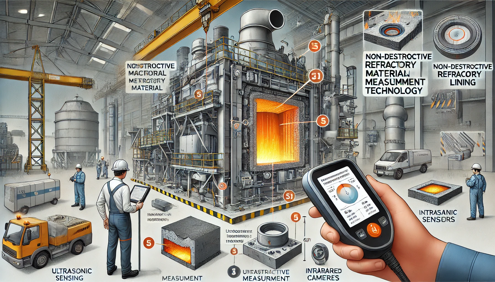

# Project Information

## Client
Posco EnC

## Duration
2024.08.12 - 2027 (3 Years)

<!-- Client Overview:
[Client Name] is a renowned industry leader known for [briefly describe the client's core activities and reputation]. With a strong focus on [mention any specific values or goals of the client], they have consistently set industry standards and pushed the boundaries of what's possible. Their vision aligns seamlessly with our mission to deliver exceptional solutions and services. -->

<!-- # Related Document -->
<!-- - -->